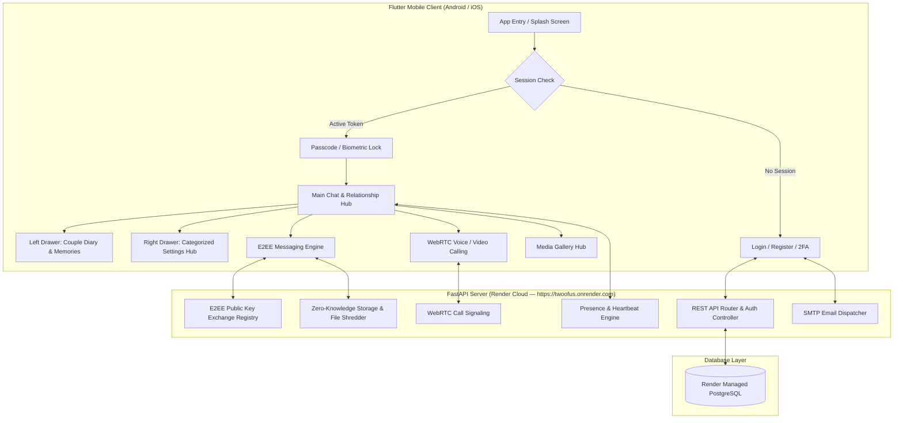

# TwoOfUs — Private & Secure Couple Space 🔒✨

<div align="center">


-brightgreen?style=for-the-badge)

**TwoOfUs** is an intimate, end-to-end encrypted (E2EE) private ecosystem designed for two connected partners. Built with **Flutter** (Android/iOS) and **FastAPI** (Python 3.11 + Render PostgreSQL), it provides a private sanctuary for real-time encrypted messaging, ephemeral view-once media, multi-method 2FA, real-time online presence, voice/video call signaling, shared diary scrapbooks, and custom romantic themes.

[Live Production Server](https://twoofus.onrender.com) • [Architecture](#-architecture) • [Features](#-key-features) • [Installation](#-getting-started) • [Testing](#-quality-assurance--automated-tests)

</div>

---

## 🌟 Key Features

### 🔐 1. End-to-End Cryptography (Zero-Knowledge Architecture)
* **Asymmetric Key Exchange**: Curve25519 (X25519 ECDH) key agreement. Private keys are generated on-device and never leave user hardware.
* **Symmetric Encryption**: XSalsa20-Poly1305 / AES-256-GCM authenticated cipher with unique cryptographic nonces.
* **Out-of-Band Safety Number Verification**: 60-digit safety numbers and interactive QR code scanner (Signal/WhatsApp standard) to prevent Man-in-the-Middle (MITM) attacks.
* **Server-Side Zero Knowledge**: The backend only routes ciphertexts and public keys. Plaintext messages, media keys, and unencrypted files never touch the server disk.

### 🛡️ 2. Multi-Method 2FA & Production Email Delivery
* **TOTP Authenticator Apps**: Compatible with Google Authenticator, Microsoft Authenticator, Apple Passwords, 1Password, and Authy.
* **Live In-App QR Code**: Direct QR scanning via `qr_flutter` using standard `otpauth://` URIs.
* **Email OTP 2FA**: 6-digit one-time codes delivered via email with 10-minute expiration.
* **Cryptographic Backup Codes**: 8 single-use recovery codes generated on 2FA setup with SHA-256 hashed storage.
* **Production SMTP Delivery**: Direct integration with Google SMTP (`smtp.gmail.com:587`) using branded responsive HTML email templates for Forgot Password Resets and 2FA OTPs.

### 💬 3. Real-Time Chat & Dynamic Presence Engine
* **Real-Time Messaging**: Real-time message exchange, quote replies, message editing, and emoji reactions.
* **Full Conversation Search**: Search conversation history with forward/backward match navigation.
* **Accurate Online Presence**: Heartbeat synchronization (`last_seen`) with genuine online detection (green pulsing indicator 🟢 appears only when partner is actively connected).
* **Live Partner Avatar**: Dynamic partner profile photo rendering in top AppBar and drawers with monogram fallback.

### 👁️ 4. Ephemeral "View-Once" Media & Shared Gallery
* **View-Once Media Sharing**: Ephemeral photos and videos that self-destruct after being opened.
* **Atomic Server Shredding**: The backend physically shreds and removes expired view-once media from disk upon consumption.
* **Shared Couple Media Hub**: Filter tabs for **Photos**, **Videos**, **Audio messages**, and **Documents**.

### 📔 5. Shared Couple Diary & Memory Timeline
* **Left Slide Drawer**: Integrated couple calendar with mood tracking.
* **Shared Memory Timeline**: Attach diary notes, mood badges, and photo albums to any date with real-time partner sync.

### 📞 6. WebRTC Voice & Video Call Signaling
* **Call Lifecycle Management**: Endpoints for `call/initiate`, `call/respond`, `call/signal`, and `call/end`.
* **Ringing & Active Call Overlays**: Smooth ringing modal with accept/reject gestures and call history logging.

### 🔒 7. App Security & Biometric Lock
* **Passcode PIN Protection**: 4-digit app passcode lock.
* **Biometrics**: Native Fingerprint & Face ID unlock via `local_auth`.
* **Auto-Lock**: Inactivity background timer with quick-lock trigger in the top AppBar.

### 🎨 8. UI/UX & Categorized Settings Hub
* **Optimized Right Drawer**: Categorized into *Couple Space*, *Preferences*, *Security & Privacy*, and *Network & Connection*.
* **6 Curated Themes**: *Midnight Romance*, *Rose Gold*, *Emerald Luxury*, *Neon Purple*, *Deep Indigo*, and *Velvet Night*.

---

## 🏛️ Architecture



---

## 📁 Project Structure

```
TwoOfUs/
├── backend/                       # FastAPI Python Backend
│   ├── app/
│   │   ├── core/                  # Database, JWT security, and configuration
│   │   ├── models/                # SQLAlchemy models (User, Pair, Message, Media, DiaryMemory, CallSession)
│   │   ├── schemas/               # Pydantic validation schemas
│   │   └── services/              # Email delivery (SMTP), TOTP 2FA, zero-knowledge storage
│   ├── tests/                     # Automated penetration, security, and integration test suites
│   ├── requirements.txt           # Production Python dependencies
│   ├── .env.example               # Backend environment variable template
│   └── pyproject.toml             # Python project configuration
│
├── frontend/
│   └── twoofus_flutter/           # Flutter Mobile Application
│       ├── lib/
│       │   ├── models/            # Data & message models
│       │   ├── screens/           # Chat, Home, Diary, Profile, 2FA Setup, Security, Call screens
│       │   ├── services/          # E2EE crypto, API client, WebRTC signaling, theme controller
│       │   ├── theme/             # Romantic color palettes & glassmorphic styles
│       │   ├── utils/             # Session persistence & encryption helpers
│       │   └── widgets/           # Image cropper, QR safety modal, media composer, lock button
│       └── pubspec.yaml           # Flutter dependencies & assets
│
├── render.yaml                    # Render Cloud Deployment Blueprint
└── README.md                      # Project documentation
```

---

## 🚀 Getting Started

### 1. Prerequisites
* **Flutter SDK**: v3.12 or higher
* **Python**: v3.11+
* **PostgreSQL** or **SQLite**

---

### 2. Backend Setup (Local Development)

```bash
cd backend
python -m venv venv

# Windows PowerShell:
.\venv\Scripts\Activate.ps1
# Linux / macOS:
source venv/bin/activate

# Install dependencies
pip install -r requirements.txt

# Copy environment template
cp .env.example .env

# Run FastAPI backend locally:
uvicorn app.main:app --host 0.0.0.0 --port 8000 --reload
```

---

### 3. Frontend Setup (Flutter Mobile)

```bash
cd frontend/twoofus_flutter

# Install Flutter packages
flutter pub get

# Run on connected phone or emulator:
flutter run
```

---

### 4. Build Standalone Release APK

```bash
cd frontend/twoofus_flutter
flutter build apk --release
```
The compiled APK will be located at:
`frontend/twoofus_flutter/build/app/outputs/flutter-apk/app-release.apk`

---

## 🧪 Quality Assurance & Automated Tests

TwoOfUs includes a test suite covering penetration testing, IDOR defenses, zero-knowledge integrity, cryptographic key exchanges, view-once atomic shredding, and multi-method 2FA lifecycles.

```bash
cd backend
python -m pytest tests/ -v
```

### Test Suite Summary:
| Test Suite | Test Cases | Status | Scope |
| :--- | :---: | :---: | :--- |
| `test_security_audit.py` | 10 | ✅ **100% Passed** | IDOR protection, View-Once shredding, E2EE key registry, password lifecycle |
| `test_two_factor_auth.py` | 10 | ✅ **100% Passed** | TOTP generation, email OTPs, backup recovery codes, 2FA login intercepts |
| `test_diary_memories.py` | 5 | ✅ **100% Passed** | Memory creation, photo attachments, partner isolation, deletion |
| `test_diary_live.py` | 3 | ✅ **100% Passed** | Live diary integration & unpaired access blocking |
| `test_live_security.py` | 4 | ✅ **100% Passed** | Endpoint authentication drops, cross-user impersonation rejection |
| `test_call_signaling.py` | 3 | ✅ **100% Passed** | WebRTC voice & video signaling lifecycle |
| **Total Test Coverage** | **35** | ✅ **35/35 Passed (100%)** | Full backend test suite passing in ~12 seconds |

---

## 🌐 Cloud Deployment (Render.com)

The repository includes a ready-to-use [`render.yaml`](render.yaml) blueprint:

1. Connect your GitHub repository to **[Render.com](https://dashboard.render.com)**.
2. Provision a **Web Service** with:
   - **Root Directory**: `backend`
   - **Build Command**: `pip install -r requirements.txt`
   - **Start Command**: `uvicorn app.main:app --host 0.0.0.0 --port $PORT`
3. Provision a free **Render PostgreSQL Database** and set the internal connection string to `DATABASE_URL`.
4. Set your `SMTP_USER` and `SMTP_PASSWORD` for live email OTP delivery.

Live API URL: **`https://twoofus.onrender.com`**

---

## 🔒 Security & Privacy Notice
TwoOfUs is architected under strict zero-knowledge principles. Cryptographic keys are generated strictly on client devices using libsodium / Curve25519 primitives. Private keys are never transmitted over the network or stored in database tables.

---

## 📄 License
Private & Proprietary — Built with ❤️ for Two.
