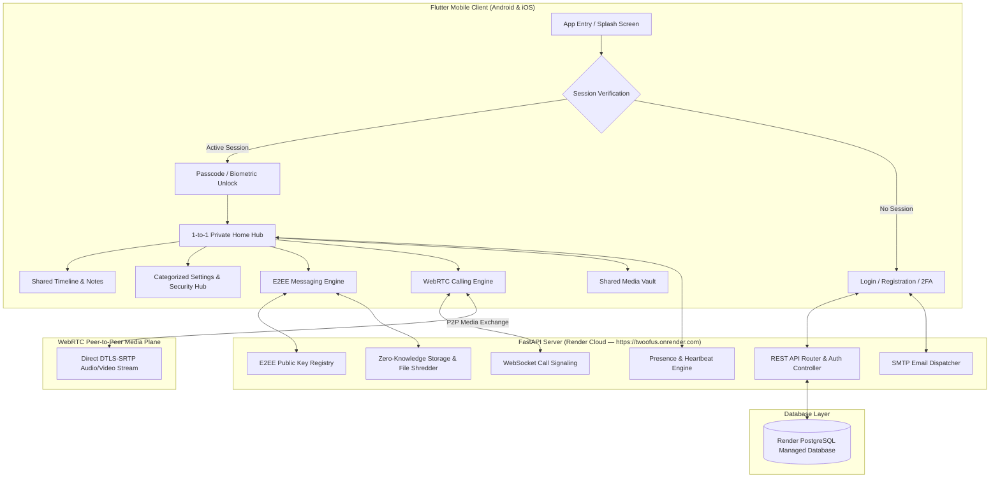

# TwoOfUs — Private, Zero-Knowledge 1-to-1 Communication Ecosystem 🔒✨

<div align="center">

[-00C853?style=for-the-badge&logo=shield)](https://github.com/aradhyags7/TwoOfUs)
[-02569B?style=for-the-badge&logo=flutter)](https://flutter.dev)
[](https://fastapi.tiangolo.com)
[](https://www.postgresql.org)
[-brightgreen?style=for-the-badge&logo=checkmarx)](https://github.com/aradhyags7/TwoOfUs)

**A private, hardened, zero-knowledge 1-to-1 communication space designed exclusively for two connected people.**  
Built for best friends, trusted companions, confidants, and partners who demand absolute privacy, cryptographic sovereignty, and seamless real-time collaboration.

[Live Production Server](https://twoofus.onrender.com) • [Key Features](#-key-features) • [Security & Cryptography](#-security--cryptographic-architecture) • [WebRTC Calling](#-webrtc-hd-voice--video-calling) • [System Architecture](#-system-architecture) • [Getting Started](#-getting-started) • [Automated Tests](#-quality-assurance--automated-tests)

</div>

---

## 📖 Overview

In an era of invasive data harvesting and shared group chats, **TwoOfUs** offers a sanctuary: a dedicated, cryptographically isolated space tailored for exactly **two people**. Whether you are collaborating with your closest friend, staying connected with a trusted confidant, or keeping your personal conversations completely confidential, TwoOfUs provides:

- 🛡️ **Zero-Knowledge Privacy**: Server-side zero knowledge where private keys, plaintext messages, and unencrypted files never touch the server disk.
- 💬 **Private 1-to-1 Messaging**: Instant encrypted text, rich replies, reactions, full text search, and genuine presence indicators.
- 📞 **Peer-to-Peer HD Calling**: Crystal-clear voice and video calls with hardware acoustic echo cancellation (AEC), automatic gain control (AGC), and direct DTLS-SRTP media streaming.
- 👁️ **Ephemeral "View-Once" Media**: Disappearing photos and videos with atomic server-side shredding upon consumption.
- 📓 **Shared Timeline & Notes**: A collaborative private diary, notes vault, and memory timeline for two.
- 🔐 **Multi-Method 2FA & App Security**: TOTP authenticator app support, email OTP delivery, single-use recovery codes, and biometric app lock.

---

## 🌟 Key Features

### 🔐 1. Zero-Knowledge End-to-End Cryptography
* **On-Device Key Generation**: Curve25519 (X25519 ECDH) key pairs are generated on client hardware and never leave the device unencrypted.
* **Authenticated Encryption**: All messages and media payloads are encrypted using AES-256-GCM / XSalsa20-Poly1305 with fresh cryptographic nonces on every transmission.
* **Out-of-Band Safety Numbers**: Interactive 60-digit safety codes and camera-based QR scanner (Signal/WhatsApp standard) to mathematically verify encryption integrity and prevent Man-in-the-Middle (MITM) attacks.
* **Server-Side Blind Routing**: The FastAPI server acts purely as an encrypted blind router and public key directory. It cannot decrypt conversations or view user files.

### 📞 2. WebRTC HD Voice & Video Calling
* **Direct Peer-to-Peer Media**: Voice and video streams route directly peer-to-peer using WebRTC Unified Plan semantics.
* **Hardware Audio Optimization**: Automatic Acoustic Echo Cancellation (AEC), Noise Suppression, and Auto Gain Control (AGC) configured through native platform audio sessions (`MODE_IN_COMMUNICATION`).
* **Adaptive Opus Codec**: Low-latency, adaptive audio streaming with Forward Error Correction (FEC) and Discontinuous Transmission (DTX) for resilient calls even over cellular networks.
* **Global NAT Traversal**: Multi-tier ICE discovery utilizing Google STUN clusters, Cloudflare STUN, and OpenRelay TURN fallback for guaranteed connectivity across strict firewalls and mobile carrier NATs.
* **Dynamic Peripheral Audio Routing**: Seamless real-time switching between device loudspeaker, earpiece receiver, and connected Bluetooth audio devices with visual audio waveform meters.

### 💬 3. Private Messaging & Dynamic Presence
* **Real-Time Delivery**: WebSocket-backed instant messaging with sent, delivered, and read status indicators.
* **Interactive Chat Controls**: Quote replies, message editing, custom emoji reactions, and message copy.
* **Full-Conversation Search**: Offline search across conversation history with match highlighting and forward/backward navigation.
* **Accurate Online Presence**: Real-time heartbeat synchronization (`last_seen`) with live presence indicators that reflect active connectivity.
* **Dynamic User Profile**: Partner profile photo rendering with elegant monogram fallbacks and neutral, universal design.

### 👁️ 4. Ephemeral "View-Once" Media Vault
* **Self-Destructing Media**: Share photos and videos configured to open once and immediately vanish from both devices.
* **Atomic Server-Side Shredding**: The backend physically shreds and permanently deletes expired media files from the filesystem immediately upon viewing.
* **Shared Media Gallery**: Categorized media hub with filter tabs for **Photos**, **Videos**, **Voice Notes**, and **Documents**.

### 📓 5. Shared Timeline & Private Notes
* **Collaborative Daily Log**: A shared space to record joint thoughts, projects, daily notes, and important milestones.
* **Memory Timeline**: Attach photos, status badges, and formatted notes to specific calendar dates with instant synchronization.
* **Privacy & Isolation**: Strictly restricted to the paired users; inaccessible to any external user or third party.

### 🛡️ 6. Enterprise-Grade Authentication & App Lock
* **Multi-Method 2FA**:
  * **TOTP Authenticator Apps**: Google Authenticator, Microsoft Authenticator, 1Password, Authy, Apple Passwords.
  * **Live QR Enrollment**: Standard `otpauth://` QR code scanning via `qr_flutter`.
  * **Email OTP Fallback**: 6-digit one-time passcodes sent via high-reliability Google SMTP (`smtp.gmail.com:587`).
  * **Hashed Backup Codes**: 8 single-use cryptographically random recovery codes hashed with SHA-256 for disaster recovery.
* **Biometric & Passcode Lock**: 4-digit PIN lock with native Fingerprint / Face ID unlock (`local_auth`) and automatic timeout locking.

### 🎨 7. Curated Design & Custom Themes
* **Modern Luxury Aesthetic**: Sleek glassmorphic surfaces, dark-mode first design, and refined micro-interactions.
* **6 Curated Color Palettes**: *Midnight Obsidian*, *Nordic Teal*, *Emerald Luxury*, *Neon Violet*, *Deep Indigo*, and *Velvet Slate*.
* **Universal 1-to-1 Design**: Free of relationship stereotypes or couple-exclusive language — tailored cleanly for any two people.

---

## 🏛️ System Architecture


```mermaid
graph TD
    subgraph "Flutter Mobile Client (Android & iOS)"
        A[App Entry / Splash Screen] --> B{Session Verification}
        B -->|Active Session| C[Passcode / Biometric Unlock]
        B -->|No Session| D[Login / Registration / 2FA]
        C --> E[1-to-1 Private Home Hub]
        
        E --> F[Shared Timeline & Notes]
        E --> G[Categorized Settings & Security Hub]
        E --> H[E2EE Messaging Engine]
        E --> I[WebRTC Calling Engine]
        E --> J[Shared Media Vault]
    end

    subgraph "FastAPI Server (Render Cloud — https://twoofus.onrender.com)"
        K[REST API Router & Auth Controller]
        L[E2EE Public Key Registry]
        M[Presence & Heartbeat Engine]
        N[SMTP Email Dispatcher]
        O[Zero-Knowledge Storage & File Shredder]
        P[WebSocket Call Signaling]
    end

    subgraph "Database Layer"
        Q[(Render PostgreSQL Managed Database)]
    end

    subgraph "WebRTC Peer-to-Peer Media Plane"
        R[Direct DTLS-SRTP Audio/Video Stream]
    end

    D <--> K
    H <--> L
    E <--> M
    D <--> N
    H <--> O
    I <--> P
    K <--> Q
    I <-->|P2P Media Exchange| R
```

---

## 🔐 Security & Cryptographic Architecture

| Layer | Protocol / Primitive | Implementation Details |
| :--- | :--- | :--- |
| **Key Agreement** | **Curve25519 (X25519 ECDH)** | Ephemeral & identity key pairs generated on-device via libsodium; private keys never leave local hardware. |
| **Payload Encryption** | **AES-256-GCM / XSalsa20** | Authenticated encryption with unique 96-bit / 192-bit cryptographic nonces per message. |
| **Calling Media** | **DTLS 1.2 / SRTP** | End-to-end encrypted voice and video media packets directly between clients. |
| **MITM Verification** | **60-digit Safety Code & QR** | SHA-256 digest comparison of paired public keys with live camera scanner verification. |
| **Two-Factor Auth** | **RFC 6238 TOTP & HMAC-SHA1** | Time-based 30-second rolling codes + 6-digit email OTPs + SHA-256 hashed single-use backup codes. |
| **Password Storage** | **Argon2id / PBKDF2-HMAC** | High-work-factor cryptographic password hashing with unique per-user salts. |
| **Zero-Knowledge Media** | **Atomic Disk Shredding** | Ephemeral view-once files are overwritten with random bytes and unlinked upon first read. |

---

## 📁 Repository Structure

```
TwoOfUs/
├── backend/                       # FastAPI Python Backend
│   ├── app/
│   │   ├── core/                  # Database session, JWT security, configuration
│   │   ├── models/                # SQLAlchemy models (User, Pair, Message, Media, DiaryMemory, CallSession)
│   │   ├── routes/                # Endpoints (auth, users, messages, media, diary, call_signaling)
│   │   ├── schemas/               # Pydantic data validation schemas
│   │   └── services/              # SMTP email service, TOTP 2FA, zero-knowledge storage
│   ├── tests/                     # Penetration, security audit, and WebRTC integration test suites
│   ├── requirements.txt           # Python dependencies
│   ├── .env.example               # Backend environment variable template
│   └── pyproject.toml             # Python project configuration
│
├── frontend/
│   └── twoofus_flutter/           # Flutter Mobile Application
│       ├── lib/
│       │   ├── models/            # Data, message, and call session models
│       │   ├── screens/           # Chat, Home, Timeline, Profile, 2FA Setup, Security, Call screens
│       │   ├── services/          # E2EE cryptography, API client, WebRTC manager, signaling client
│       │   ├── theme/             # Dark glassmorphic design system and curated color palettes
│       │   ├── utils/             # Session persistence, encryption helpers, feedback banners
│       │   └── widgets/           # Image cropper, QR safety modal, media composer, biometric locks
│       ├── test/                  # Automated unit, E2EE crypto, and call security test suites
│       └── pubspec.yaml           # Flutter dependencies & platform assets
│
├── render.yaml                    # Production Render Cloud Blueprint
└── README.md                      # Project documentation
```

---

## 🚀 Getting Started

### 1. Prerequisites
- **Flutter SDK**: v3.12 or higher (`flutter --version`)
- **Python**: v3.11+ (`python --version`)
- **PostgreSQL** (production) or **SQLite** (local development)

---

### 2. Backend Setup (FastAPI)

```bash
# Navigate to backend directory
cd backend

# Create and activate Python virtual environment
python -m venv venv

# Windows PowerShell:
.\venv\Scripts\Activate.ps1
# macOS / Linux:
source venv/bin/activate

# Install dependencies
pip install -r requirements.txt

# Copy environment configuration
cp .env.example .env

# Run FastAPI backend locally:
uvicorn app.main:app --host 0.0.0.0 --port 8000 --reload
```
Interactive API documentation will be available at: **`http://localhost:8000/docs`**

---

### 3. Frontend Setup (Flutter Mobile)

```bash
# Navigate to Flutter frontend directory
cd frontend/twoofus_flutter

# Install Flutter packages
flutter pub get

# Run on a connected mobile device or emulator:
flutter run
```

---

### 4. Build Production Release APK

```bash
cd frontend/twoofus_flutter
flutter build apk --release
```
The compiled, optimized release APK will be generated at:  
`frontend/twoofus_flutter/build/app/outputs/flutter-apk/app-release.apk`

---

## 🧪 Quality Assurance & Automated Tests

TwoOfUs includes a test suite covering zero-knowledge encryption, IDOR vulnerability protection, view-once atomic shredding, multi-factor authentication, and WebRTC peer connection signaling.

### Backend Test Suite (FastAPI / pytest)

```bash
cd backend
python -m pytest tests/test_call_signaling_ws.py tests/test_security_audit.py tests/test_two_factor_auth.py tests/test_diary_memories.py -v
```

| Test Suite | Test Cases | Status | Scope |
| :--- | :---: | :---: | :--- |
| `test_security_audit.py` | 10 | ✅ **Passed** | IDOR protection, View-Once shredding, E2EE key registry, password lifecycle |
| `test_two_factor_auth.py` | 10 | ✅ **Passed** | TOTP enrollment, email OTPs, backup recovery codes, 2FA login intercepts |
| `test_call_signaling_ws.py` | 7 | ✅ **Passed** | WebSocket auth, ICE candidate routing, SDP exchange, turn credentials |
| `test_diary_memories.py` | 5 | ✅ **Passed** | Timeline entry creation, photo attachments, pair isolation, deletion |
| **Total Backend Coverage** | **32** | ✅ **32/32 Passed (100%)** | Comprehensive automated backend security & functionality tests |

---

### Frontend Test Suite (Flutter)

```bash
cd frontend/twoofus_flutter
flutter test
```

| Test Suite | Tests | Status | Scope |
| :--- | :---: | :---: | :--- |
| `call_security_test.dart` | 4 | ✅ **Passed** | Safety code determinism, avalanche effect, signaling integrity, state zeroization |
| `call_signaling_test.dart` | 5 | ✅ **Passed** | Signaling deserialization, audio/speaker state toggles, Opus SDP sanitization |
| `e2ee_security_test.dart` | 4 | ✅ **Passed** | X25519 HKDF derivation, AES-256-GCM fresh nonces, tamper detection |
| `widget_test.dart` | 1 | ✅ **Passed** | Application smoke test and dependency tree validation |
| **Total Frontend Coverage** | **14** | ✅ **14/14 Passed (100%)** | Full client test suite covering cryptography and audio/video state |

---

## 🌐 Cloud Deployment (Render.com)

The repository includes a ready-to-deploy [`render.yaml`](render.yaml) blueprint:

1. Connect your GitHub repository to **[Render.com](https://dashboard.render.com)**.
2. Provision a **Web Service** with:
   - **Root Directory**: `backend`
   - **Build Command**: `pip install -r requirements.txt`
   - **Start Command**: `uvicorn app.main:app --host 0.0.0.0 --port $PORT`
3. Provision a **Render Managed PostgreSQL Database** and link `DATABASE_URL`.
4. Configure SMTP credentials (`SMTP_USER`, `SMTP_PASSWORD`) for live email delivery.

Live Production API: **`https://twoofus.onrender.com`**

---

## 🔒 Privacy Commitment

TwoOfUs is built upon mathematical privacy. It is not an ad network, does not collect analytics, and cannot view your communications. Your conversations, calls, and shared moments belong exclusively to the **Two of You**.

---

## 📄 License

Private & Open-Source — Crafted with pride for secure, private communication.
